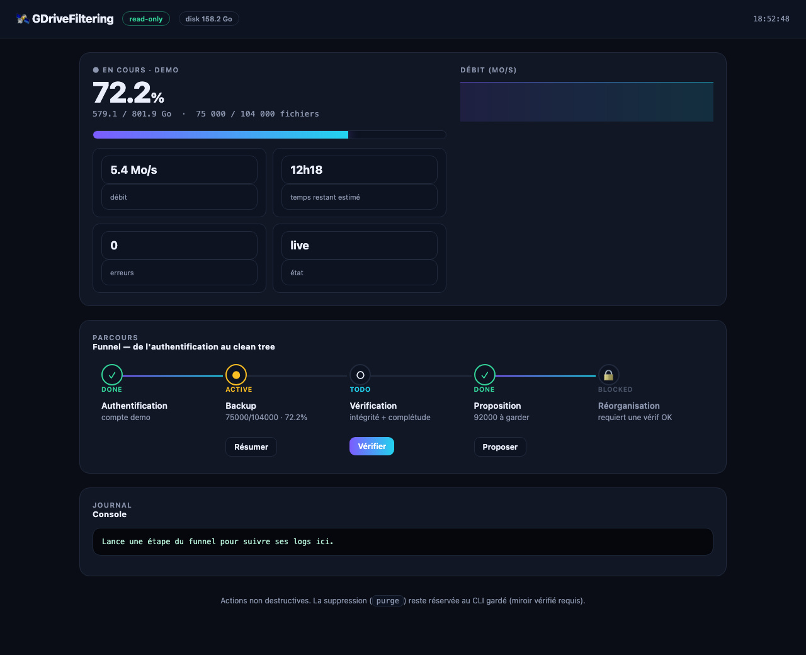

<p align="center">
  
</p>

<h1 align="center">GDriveFiltering</h1>

<p align="center">
  <b>Back up your entire Google Drive locally — My Drive, Shared Drives and "Shared with me" —
  then verify, deduplicate and reorganize it into a clean tree. Nothing is ever deleted before a verified backup exists.</b>
</p>

<p align="center">
  
  
  
  
  
</p>

A fast, resumable, read-only Google Drive backup and cleanup tool in Python, with a native
desktop app and a live local dashboard. Ideal for archiving a large Drive to an external disk,
migrating accounts, or de-cluttering years of files — safely.



---

## Why

Google Takeout is a one-shot ZIP with no dedup, no structure, and no resume. `rclone` mirrors
bytes but won't tell you what's junk, what's duplicated, or how to reorganize it.
**GDriveFiltering** is built for a real, large Drive (100k+ files, hundreds of GB):

- **Complete coverage** — My Drive **+ every Shared Drive + "Shared with me"** (including the
  contents of shared folders, listed recursively).
- **Read-only on Drive** — requests the `drive.readonly` scope. It physically cannot modify or
  delete anything in your Drive.
- **Incremental** — a new backup reuses unchanged files from the previous one via hash-verified
  local copies. Zero re-download of data already on the drive.
- **Safe by construction** — disk-space preflight, unplugged-drive guard, SHA-256 + completeness
  verification. Nothing is deleted until a verified primary **and** external backup exist; dedup
  and cleanup only *detect, report and quarantine* into a **copy**.
- **Understands your files** — exact (SHA-256) + optional semantic (local Ollama) duplicate
  detection, junk filtering, and a clean-tree proposal with an **editable plan**.
- **Desktop app + live dashboard** — a native window (or your browser) with progress, ETA,
  a guided funnel and one-click actions.

## Desktop app (macOS / Windows)

Double-clickable — no terminal.

```bash
make app        # macOS: builds ~/Desktop/GDriveFiltering.app (native window, icon included)
```

Windows: run `desktop/windows/GDriveFiltering.vbs` (make a Desktop shortcut). See
[desktop/README.md](desktop/README.md).

## Safety model

| Guarantee | How |
|---|---|
| Never modifies your Drive | `drive.readonly` OAuth scope |
| Never deletes before a backup exists | destructive `purge` refuses without a verified primary + external mirror |
| Never fills the wrong disk | refuses to run if the external volume is unplugged |
| Never loses data to name clashes | case-insensitive unique local paths (exFAT/APFS/NTFS safe) |
| Never reports an incomplete backup as done | verify checks count **and** per-file SHA-256; a circuit breaker aborts on outages |
| Reorg never touches the source | it writes a **new copy**; duplicates/junk go to `_quarantine/` |

## Quick start

```bash
git clone https://github.com/SoCloseSociety/GDriveFiltering.git
cd GDriveFiltering
make setup                      # venv + dependencies
cp .env.example .env            # then add your Google OAuth client id/secret
```

Create an OAuth client of type **Desktop app** in the
[Google Cloud Console](https://console.cloud.google.com/apis/credentials) with the **Google Drive
API** enabled, and paste the ID/secret into `.env`.

```bash
python -m gdrivefilter doctor                 # check config, disk, Ollama
python -m gdrivefilter auth --account me      # one-time browser consent (read-only)
python -m gdrivefilter backup --account me    # resumable, parallel, incremental, read-only
python -m gdrivefilter status --account me --watch   # live progress bar + ETA
python -m gdrivefilter propose --account me   # clean-tree proposal + editable plan.csv
python -m gdrivefilter app                    # native desktop window (or `dashboard` for browser)
```

## Commands

| Command | What it does |
|---|---|
| `doctor` | Check credentials, disk space and Ollama availability |
| `auth` | One-time OAuth consent (loopback, dual-stack IPv4/IPv6) |
| `backup` | Mirror all drives locally — read-only, parallel, **resumable & incremental** |
| `status [--watch]` | Live progress: bar, %, GB, throughput, ETA |
| `app` / `dashboard` | Native window / browser control panel (monitoring + quick actions) |
| `verify` | Re-check a backup: count + size + SHA-256 |
| `dedup` | Detect exact (and optional semantic) duplicates — report only |
| `propose` | Analyze the backup, propose a clean tree + editable `plan.csv` |
| `reorganize [--plan]` | Build a clean categorized tree **as a copy** (or apply your edited plan) |
| `purge` | Delete duplicates from the copy — ultra-guarded, opt-in |

## How it works

```
Google Drive (My Drive + Shared Drives + Shared with me)
      │  Drive API v3 · read-only
      ▼
 extract ──► local mirror (+ optional external mirror), resumable & incremental
      ▼
 verify ──► SHA-256 + completeness gate
      ▼
 dedup + filter ──► exact/semantic duplicates, junk detection (report only)
      ▼
 propose / reorganize ──► clean tree by category/year (or your edited plan), as a COPY
```

- **Manifest** — a JSON index (SHA-256, size, path, mime, owner, drive) that doubles as the resume log.
- **Streaming** — files stream to disk in chunks, so memory stays bounded even for multi-GB videos.
- **Parallel** — a configurable thread pool (`DOWNLOAD_WORKERS`) with a thread-local Drive client,
  network-timeout retries, connection-drop self-heal and a systemic-outage circuit breaker.
- **Ollama-first** — optional semantic dedup/classification runs on a local model; degrades
  gracefully if Ollama isn't running.

## Requirements

- Python 3.11+
- A Google Cloud OAuth client (Desktop app) with the Drive API enabled
- Optional: [Ollama](https://ollama.com) for semantic dedup (`bge-m3`) and classification
- Optional: `pywebview` (installed on demand by the desktop app) for the native window

## Tests

```bash
make test      # 75 tests, no network — a fake Drive API covers the whole pipeline
```

## Contributing

Issues and PRs welcome. The whole download/dedup/reorg pipeline is covered by a fake Drive
backend, so you can develop and test offline.

## License

MIT — see [LICENSE](LICENSE).

---

<sub>Keywords: google drive backup, download entire google drive, shared drive backup, google drive
deduplication, reorganize google drive, incremental drive backup, python google drive cli,
resumable drive backup, local drive archive, self-hosted.</sub>
