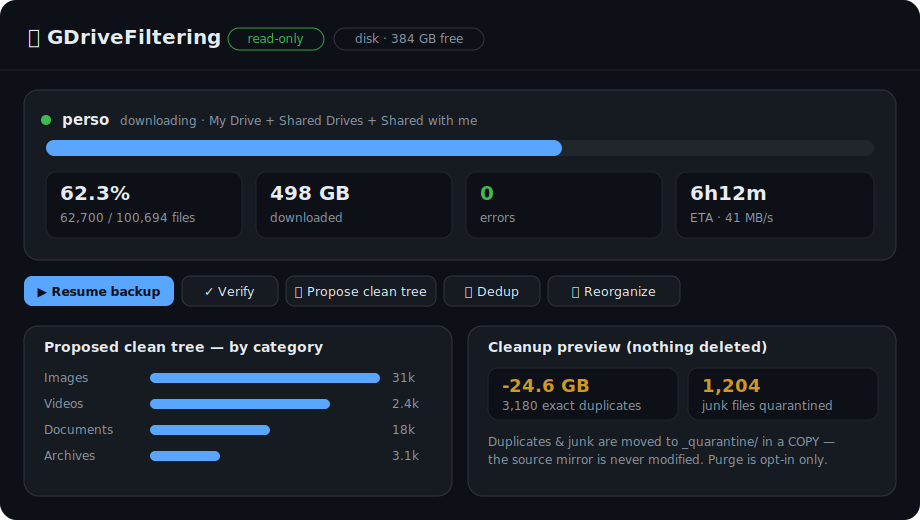

# GDriveFiltering

**Back up your entire Google Drive locally — My Drive, Shared Drives and "Shared with me" — then verify, deduplicate and reorganize it into a clean tree. Nothing is ever deleted before a verified backup exists.**

A fast, resumable, read-only Google Drive backup and cleanup tool in Python, with a live local dashboard. Ideal for archiving a large Drive to an external disk, migrating accounts, or de-cluttering years of files — safely.



<p>


</p>

---

## Why

Google Takeout is a one-shot ZIP with no dedup, no structure, and no resume. `rclone` mirrors bytes but won't tell you what's junk, what's duplicated, or how to reorganize it. **GDriveFiltering** is built for a real, large Drive (100k+ files, hundreds of GB):

- **Complete coverage** — My Drive **+ every Shared Drive + "Shared with me"**, in one pass.
- **Read-only on Drive** — the tool requests the `drive.readonly` scope. It physically cannot modify or delete anything in your Drive.
- **Safe by construction** — nothing is deleted until a verified primary **and** external backup exist. Dedup and cleanup only *detect, report and quarantine* into a **copy**.
- **Built for scale** — parallel streaming downloads (memory-bounded), resumable to the file, disk-space preflight, network-timeout self-heal.
- **Understands your files** — exact-duplicate detection (SHA-256), optional semantic near-duplicate detection via a **local** LLM (Ollama), junk/clutter filtering, and a proposed clean tree by category/year.
- **Live dashboard** — a local web control panel to monitor progress and run quick actions.

## Safety model

| Guarantee | How |
|---|---|
| Never modifies your Drive | `drive.readonly` OAuth scope |
| Never deletes before a backup exists | destructive `purge` refuses without a verified primary + external mirror |
| Never loses data to name clashes | case-insensitive unique local paths (exFAT/APFS/NTFS safe) |
| Never reports an incomplete backup as done | verify checks count **and** per-file SHA-256 |
| Reorg never touches the source | it writes a **new copy**; duplicates/junk go to `_quarantine/` |

## Quick start

```bash
git clone https://github.com/SoCloseSociety/GDriveFiltering.git
cd GDriveFiltering
make setup                      # venv + dependencies
cp .env.example .env            # then add your Google OAuth client id/secret
```

Create an OAuth client of type **Desktop app** in the [Google Cloud Console](https://console.cloud.google.com/apis/credentials) with the **Google Drive API** enabled, and paste the ID/secret into `.env`.

```bash
python -m gdrivefilter doctor                 # check config, disk, Ollama
python -m gdrivefilter auth --account me      # one-time browser consent (read-only)
python -m gdrivefilter backup --account me    # resumable, parallel, read-only
python -m gdrivefilter status --account me --watch   # live progress bar + ETA
python -m gdrivefilter propose --account me   # proposed clean tree (txt/json/html)
python -m gdrivefilter dashboard              # http://127.0.0.1:8787
```

## Commands

| Command | What it does |
|---|---|
| `doctor` | Check credentials, disk space and Ollama availability |
| `auth` | One-time OAuth consent (loopback, dual-stack IPv4/IPv6) |
| `backup` | Mirror all drives locally — read-only, parallel, **resumable** |
| `status [--watch]` | Live progress: bar, %, GB, throughput, ETA |
| `dashboard` | Local web UI: monitoring + quick actions |
| `verify` | Re-check a backup: count + size + SHA-256 |
| `dedup` | Detect exact (and optional semantic) duplicates — report only |
| `propose` | Analyze the backup and propose a clean tree (txt/json/HTML) |
| `reorganize` | Build a clean categorized tree **as a copy** |
| `purge` | Delete duplicates from the copy — ultra-guarded, opt-in |

## Dashboard

`python -m gdrivefilter dashboard` starts a local web app (bound to `127.0.0.1`, never exposed) with:

- Live progress per account — bar, ETA, throughput sparkline, error count
- Breakdown by category / source / year, duplicates and junk
- **Quick actions**: resume backup, verify, propose clean tree, dedup, reorganize (dry-run), open folder
- A live log console for each action

The destructive `purge` is intentionally **not** exposed in the dashboard.

## How it works

```
Google Drive (My Drive + Shared Drives + Shared with me)
      │  Drive API v3 · read-only
      ▼
 extract ──► local mirror (+ optional external mirror), resumable via manifest
      ▼
 verify ──► SHA-256 + completeness gate
      ▼
 dedup + filter ──► exact/semantic duplicates, junk detection (report only)
      ▼
 propose / reorganize ──► clean tree by category/year, as a COPY
```

- **Manifest** — a JSON index (SHA-256, size, path, mime, owner, drive) that doubles as the resume log.
- **Streaming** — files stream to disk in chunks, so memory stays bounded even for multi-GB videos.
- **Parallel** — a configurable thread pool (`DOWNLOAD_WORKERS`) with a thread-local Drive client and network-timeout retries.
- **Ollama-first** — optional semantic dedup/classification runs on a local model; it degrades gracefully if Ollama isn't running.

## Requirements

- Python 3.11+
- A Google Cloud OAuth client (Desktop app) with the Drive API enabled
- Optional: [Ollama](https://ollama.com) for semantic dedup (`bge-m3`) and classification

## Tests

```bash
make test      # 75 tests, no network — a fake Drive API covers the pipeline
```

## Contributing

Issues and PRs are welcome. The whole download/dedup/reorg pipeline is covered by a fake Drive backend, so you can develop and test offline.

## License

MIT — see [LICENSE](LICENSE).

---

<sub>Keywords: google drive backup, download entire google drive, shared drive backup, google drive deduplication, reorganize google drive, python google drive cli, resumable drive backup, local drive archive, self-hosted.</sub>
